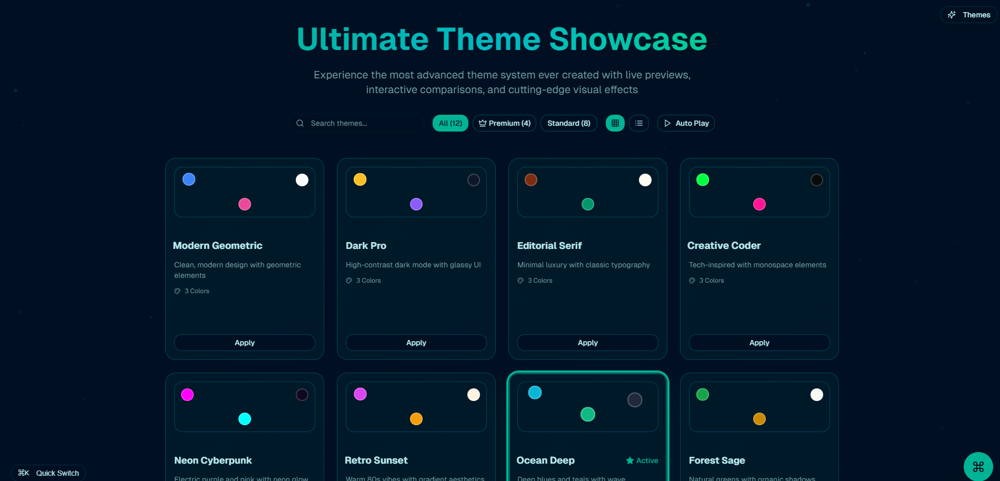

# 🌟 Advanced Theme Showcase Demo

  

  

---

## 📖 Overview

This interactive demo showcases a **comprehensive collection of premium design themes**, each with its own unique visual identity and aesthetic.  
It demonstrates how different design systems can **transform the same content**, giving clients, design teams, and developers a powerful way to explore and compare visual approaches.

---

## ✨ Key Features

### 🎨 **12 Unique Design Themes**

A curated set of themes, each telling its own story:

- **Modern Geometric** – Clean, sharp lines with vibrant colors  
- **Dark Pro** – Professional glass morphism dark mode  
- **Editorial Serif** – Elegant, typography-focused with warm aesthetics  
- **Creative Coder** – Retro terminal with matrix green vibes  
- **Neon Cyberpunk** – Futuristic neon pinks & purples  
- **Retro Sunset** – 80s nostalgia with warm gradients  
- **Ocean Deep** – Deep blues & teals with wave effects  
- **Forest Sage** – Natural, organic earthy tones  
- **Royal Luxury** ⭐ (Premium) – Champagne gold luxury elegance  
- **Holographic Matrix** ⭐ (Premium) – Rainbow holographic projections  
- **Quantum Void** ⭐ (Premium) – Cosmic particle-inspired design  
- **Neural Network** ⭐ (Premium) – Bio-tech synaptic effects  

---

### ⚡ **Instant Theme Switching**
- One-click application across the full UI  
- Smooth, animated transitions  
- Real-time preview before committing  

---

### 🔍 **Advanced Theme Comparison**
- Side-by-side comparison of any two themes  
- Independent selection per panel  
- Isolated previews for clarity  
- Full UI element coverage (cards, buttons, typography, etc.)  

---

### 🎯 **Interactive Demo Sections**
- **Typography Showcase** – headings, body text, and styled elements  
- **Component Library** – preview of cards, forms, and UI elements  
- **Color Palettes** – exact theme colors displayed  
- **Animations & Effects** – neon glows, glass blur, wave sweeps, particle fields  

---

### 🚀 **Premium Theme Features**
Premium themes feature **special indicators** for high-end projects:
- **Royal Luxury** – dark elegance with liquid gold  
- **Holographic Matrix** – holographic futurism  
- **Quantum Void** – cosmic deep-space particles  
- **Neural Network** – biotech futuristic patterns  

---

### 💫 **Enhanced User Experience**
- Fully responsive across all devices  
- Smooth micro-interactions and transitions  
- Intuitive navigation with clear hierarchy  
- Performance-optimized for speed  

---

## 👥 Use Cases

### 🔹 **For Design Teams**
- Explore multiple design directions  
- Present polished options to stakeholders  
- Test user engagement with visual styles  

### 🔹 **For Clients**
- Visualize brand aesthetics in real time  
- Compare and contrast multiple directions  
- Make confident design decisions  

### 🔹 **For Developers**
- Learn advanced theming implementation  
- See design consistency in action  
- Explore reusable UI/UX patterns  

---

## 💡 Why This Demo Stands Out

This isn’t just a theme switcher — it’s a **storytelling engine**.  
Each theme creates a **unique atmosphere** while keeping functionality consistent, proving the **impact of design on perception and branding**.

The same content can feel **playful, luxurious, futuristic, or natural** simply by changing its visual language.  
That’s the power of design systems at work.  

---

## 🚀 Try It Yourself

Switch between themes and see how the **same content tells different stories**:  
👉 [**Live Demo Here**](https://theme-selector-demo.netlify.app)

---
